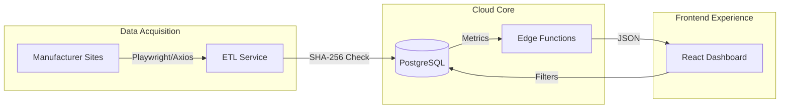

# 💡 Bright Choice: Enterprise Competitive Intelligence Platform

[](https://github.com/Raulgarcia12/bright_choice)
[](https://opensource.org/licenses/MIT)

**Bright Choice** is a high-performance Competitive Intelligence (CI) platform designed for the North American lighting industry. It automates the collection, normalization, and analysis of complex product data across major manufacturers, providing procurement teams and analysts with a strategic, data-driven edge.

---

## 🚀 Technical Highlights

### 🤖 Advanced ETL & Scraper Architecture
Our modular scraper service handles heterogeneous data sources with enterprise-grade robustness:
- **Multi-Engine Adapters:** Custom adapters using **Playwright** (dynamic JS rendering), **Cheerio** (high-speed static parsing), and **REST APIs**.
- **Data Integrity:** Implements **SHA-256 hashing** to detect granular specification changes and maintain a versioned, immutable change log.
- **Resiliency:** Built-in **Exponential Backoff** retry logic, proxy-ready request rotation, and domain-specific **Rate Limiting**.

### 📊 Business Intelligence & ROI Drivers
- **The Efficiency Frontier:** A real-time scatter plot analysis of $Price$ vs. $Luminous\ Efficacy\ (lm/W)$, identifying market leaders and over-priced outliers.
- **Convenience Score™:** A proprietary weighted algorithm that aggregates technical performance and warranty terms into a single, comparable metric.
- **Competitive Gap Analysis:** Automated benchmarking of manufacturer performance against market averages across different product categories (Bulb, Panel, High Bay).

### 🛠️ Cloud & Full-Stack Mastery
- **Serverless Analytics:** Business logic offloaded to **Supabase Edge Functions (Deno)** to ensure high-speed KPI computation on large datasets.
- **Granular Security:** Professional implementation of **Row Level Security (RLS)** at the database layer, combined with Role-Based Access Control (RBAC) in React.
- **Scalable UI:** Optimized for high data volume ($500+$ products) with client-side virtualization and smart pagination.

---

## 🏗️ System Architecture



| Layer | Technology Stack | Key Responsibilities |
|-------|------------------|----------------------|
| **Frontend** | React 18, TypeScript, Tailwind, Shadcn UI | Data Visualization, Interactive Catalog, Comparison |
| **Backend** | Supabase Edge Functions, Deno | Auth, Webhooks, Multi-Product Comparison Logic |
| **Database** | PostgreSQL | RLS Policies, Materialized Views, Change Triggers |
| **ETL/Data** | Node.js, TSX, Playwright | Web Crawling, Normalization, Change Detection |
| **DevOps** | GitHub Actions, Vercel | CI/CD Pipelines, Automated Bi-weekly Scraping |

---

## 📁 Repository Structure

```text
bright_choice/
├── src/                          # Modern React Application
│   ├── lib/convenience/          # Proprietary Business Logic
│   └── components/visuals/       # Recharts Integration (Efficiency Frontier)
├── services/scraper/             # Node.js ETL Tooling
│   ├── src/brands/               # Manufacturer Adapters
│   └── src/detector/             # Hashing & Versioning Engine
├── supabase/
│   ├── functions/                # Serverless Business logic
│   └── migrations/               # Version-controlled SQL Schema
└── .github/workflows/            # Automated Scraper Pipeline (CRON)
```

---

## ⚙️ Engineering Setup

### Prerequisites
- Node.js 18.x
- Supabase CLI / Project
- Playwright (for dynamic scrapers)

### 1. Project Initialization
```bash
git clone https://github.com/Raulgarcia12/bright_choice.git
cd bright_choice
npm install
```

### 2. Service-Level Environment
Configure the Scraper and Frontend with your Supabase keys:
```env
VITE_SUPABASE_URL=YOUR_SUPABASE_PROJECT_URL
VITE_SUPABASE_PUBLISHABLE_KEY=YOUR_ANON_KEY
```

### 3. Database Sync
Apply the professional schema (Tables, RLS, Views) via the Supabase SQL Editor:
`supabase/migrations/20260218010000_competitive_intelligence_schema.sql`

---

## 🔒 Security & Standards
- Standardized use of **TypeScript** for end-to-end type safety.
- **RLS (Row Level Security)** enforced on every table to ensure data tenancy and role isolation.
- Structured **Winston Logging** for audit trails and ETL debugging.
- **I18n** support for global scalability (EN/ES).

---

## 📬 Contact & Portfolio
This project demonstrates senior-level proficiency in **Data Engineering**, **System Architecture**, and **Modern Full-Stack Development**. 

**Author:** [Raul Garcia](https://github.com/Raulgarcia12)  
**LinkedIn:** [Your Profile Link Here]  
**Email:** [Your Email Here]  

---
<p align="center">
  Generated with focus on data-driven engineering and professional excellence.
</p>
